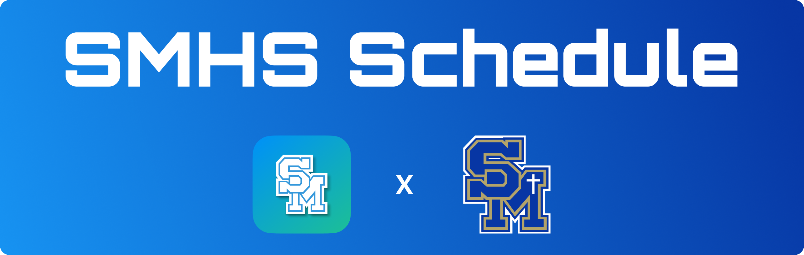
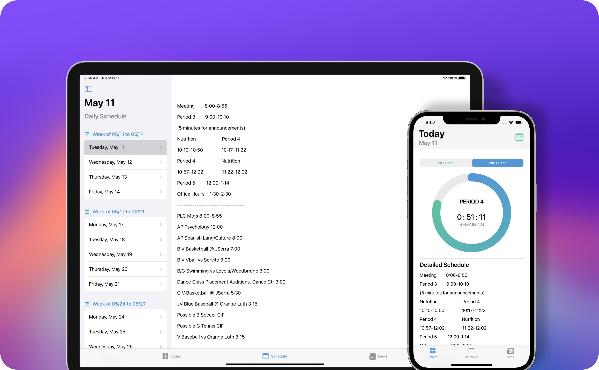
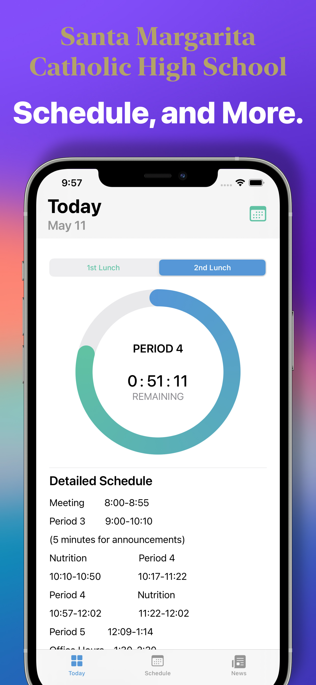
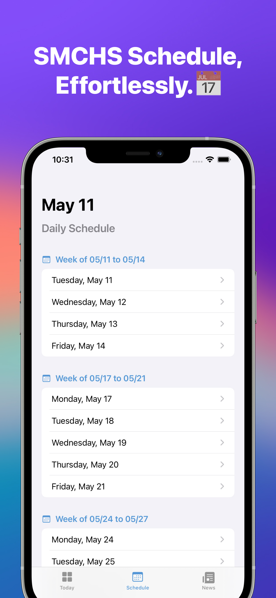
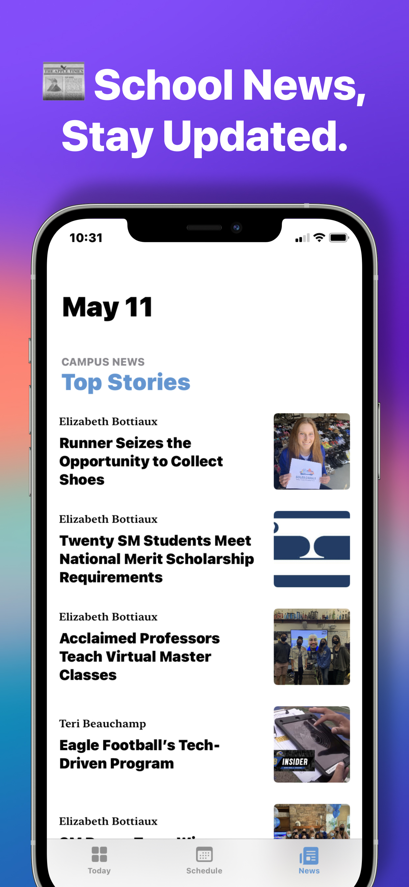
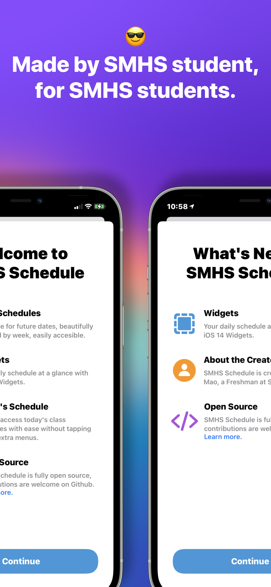

<p align="center">
    
</p>

# SMHS Schedule: A SwiftUI app for viewing the SMHS schedule
**SMHS Schedule** is the one-stop experience for Santa Margarita Catholic High School's students, much better than the official SMHS app. Made by a SMHS student, for SMHS students, SMHS Schedule aims to deliver a beautiful and native app experience. If you like this project, please `star ★`. 

DOWNLOAD NOW on the App Store 👇
<p float="left">
    <a href="https://apps.apple.com/us/app/smhs-schedule-news-more/id1565099095" title="SMHS Schedule on App Store">


    </a>
</p>

The backend serverside code for this app -> https://github.com/jevonmao/SMHS-Schedule-Backend

<p align="center">
    
</p>

<p align="center"> SMHS Schedule looks equally gorgeous on your iPhone and iPad. </p>

## 🧭 Navigation
- [Tasklist](#-tasklist)
- [Build](#-build)
- [Features](#-features)
- [Why](#-why)
- [Contribute](#-contribute)
- [License](#-license)

## ✅ Tasklist 
- [x] Schedule screen showing list of all future dates' schedules
- [x] Today screen for quickly accessing today's schedule
- [x] [iOS 14 Widgets showing today's schedule](https://github.com/jevonmao/SMHS-Schedule/issues/4)
- [x] [Ring progress circle to show live time left of the current schedule block](https://github.com/jevonmao/SMHS-Schedule/issues/5)
- [x] [Beautiful in-app reader for school news browsing](https://github.com/jevonmao/SMHS-Schedule/issues/6)
- [x] Streaming Eagle TV 2.0 in app
- [x] [School master calendar](https://github.com/jevonmao/SMHS-Schedule/issues/29)
- [x] [Check Aeries grade book grades](https://github.com/jevonmao/SMHS-Schedule/issues/47)
- [ ] Customizable app icon
- [ ] School announcements in app & announcement notifications

## 🔨 Build
This repo is an Xcode Project that contains the SMHS Schedule cross platform app for iOS and macOS. To get things running:

### Prerequisite
1. A Mac running macOS Catalina 10.15.4 or later
2. Xcode 12.1 or later

### Steps
1. Clone or fork the repo 
```
https://github.com/jevonmao/SMHS-Schedule.git
```
2. Open the `SMHSSchedule.xcodeproj` file to load project
3. On the upper left corner, select approriate scheme for iOS or macOS
4. Swift Package Manager should automatically install all dependencies, and you can now build or run the app!
5. Note: Select SMHSSchedule(iOS) Release for release build, or SMHSSchedule(iOS) Debug for debug build. Ignore other schemes.
To learn more about SPM, click [here](https://swift.org/package-manager/)

## ✨ Features


<h3>InClass™ Countdown</h3>
The InClass™ countdown features a live countdown and a progress ring that displays time left for the current period. Easily visualize the time left in class and get on top of your schedule.
<br /><br />


<br />

<h3>SMHS Schedule, Effortlessly.</h3>
The Schedule tab makes it effortlessly easy to view all your class schedules. For all future dates. Browse through all the schedule dates in a beautiful list, and tap on any date to glance the detailed schedule for that day.
<br /><br />


<br />

<h3>School News, Stay Updated.</h3>
Stay updated on the newest campus news stories, all on your fingertips. SMHS Schedule provides a supercharged in-app school news reading experience, with gorgeous photos and graphics, and iOS native reader view.
<br /><br />


<br />

<h3>Made by SMHS Student, For SMHS Students.</h3>
This is a project of Jevon Mao, a class of 2024 student at SMHS. SMHS Schedule is built ground-up from a students' perspective, and will undergo constant update bringing new features.
<br /><br />

<br />

## ❓ Why

The reasons for building this project, SMHS Schedule, are private and public. On a private level, the creator is a SMHS student and need to see the class schedule several times a day. The official SMHS app is poorly built and while acheiving the function of class schedules, left plenty of room for improvements. And since Jevon had some knowledge of Swift and iOS development, he decided to make a better app for himself. 

But at the same time, SMHS Schedule has a purpose on the public level. For the 1600 students attending SMHS, this app will greatly enhance students' school experience by providing a one-stop app that offers a variety of features. When compared to the official SMHS app, SMHS Schedule is designed and built better to specifically solve the issues that the official app failed on. The creator wanted to use his software skills to produce something meaningful for his school and his fellow students.

## 💪 Contribute

Contributions are welcome here for coders and non-coders alike. No matter what your skill level is, you can for certain contribute to SMHS Schedule's open source community. 

Please read contributing.md before starting. Check the issues or the README feature tasklist for things to work on.

**If you encounter ANY issue, have ANY concerns, or ANY comments, please do NOT hesitate to let me know.** Open a discussion, issue, or email me. As a developer, I feel you when you don't understand something in the codebase. I try to comment and document as best as I can, but if you happen to encounter any issues, I will be happy to assist in any way I can.

## ⚖️ License
SMHS Schedule is created by Jingwen (Jevon) Mao and licensed under the [MIT License](https://jingwen-mao.mit-license.org)

<br />

[JUMP TO TOP](#-navigation)
