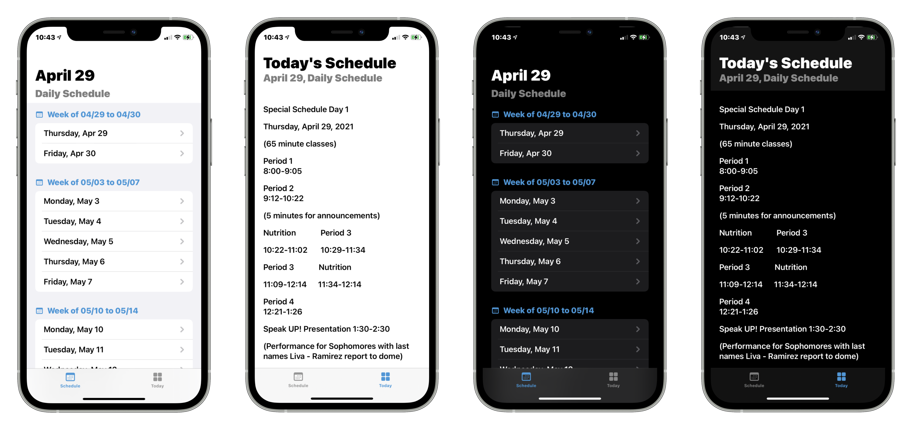

<p align="center">
    
</p>

# SMHS Schedule: A SwiftUI app for viewing the SMHS schedule
**SMHS Schedule** is an app made for viewing Santa Margarita Catholic High School's schedule, much better than the official SMHS app. **SMHS Schedule** is made by a SMHS student, for SMHS students, and aims to deliver a beautiful and native app experience. If you like this project, please `star ★`. 

Available beta testing on [TestFlight](https://testflight.apple.com/join/NkPUafoE) 👈:

[](https://testflight.apple.com/join/NkPUafoE)

<p align="center">
    
</p>

<p align="center"> SMHS Schedule looks equally gorgeous on both ☀️ light and 🌑 dark mode. </p>

## 🧭 Navigation
- [Features Tasklist](#-features-tasklist)
- [Build](#-build)
- [Contribute](#-contribute)
- [License](#-license)

## ✅ Features Tasklist 
- [x] Turbo fast app launching and loading
- [x] Schedule screen showing list of all future dates' schedules
- [x] Today screen for quickly accessing today's schedule
- [ ] ["What's New" onboarding modal](https://github.com/jevonmao/SMHS-Schedule/issues/3)
- [ ] [iOS 14 Widgets showing today's schedule](https://github.com/jevonmao/SMHS-Schedule/issues/4)
- [ ] [Ring progress circle to show live time left of the current schedule block](https://github.com/jevonmao/SMHS-Schedule/issues/5)
- [ ] [Web scrape school website's news, and show news content in app](https://github.com/jevonmao/SMHS-Schedule/issues/6)

## 🔨 Build
This repo is an Xcode Project that contains the SMHS Schedule cross platform app for iOS and macOS. To get things running:

### Prerequisite
1. A Mac running macOS Catalina 10.15.4 or later
2. Xcode 12.1 or later

### Steps
1. Clone or fork the repo 
```
https://github.com/jevonmao/SMHS-Schedule.git
```
2. Open the `SMHSSchedule.xcodeproj` file to load project
3. On the upper left corner, select approriate scheme for iOS or macOS
4. Swift Package Manager should automatically install all dependencies, and you can now build or run the app!
To learn more about SPM, click [here](https://swift.org/package-manager/)

## 💪 Contribute

Contributions are welcome here for coders and non-coders alike. No matter what your skill level is, you can for certain contribute to SMHS Schedule's open source community. 

Please read contributing.md before starting. Check the issues or the README feature tasklist for things to work on.

**If you encounter ANY issue, have ANY concerns, or ANY comments, please do NOT hesitate to let me know.** Open a discussion, issue, or email me. As a developer, I feel you when you don't understand something in the codebase. I try to comment and document as best as I can, but if you happen to encounter any issues, I will be happy to assist in any way I can.

## ⚖️ License
SMHS Schedule is created by Jingwen (Jevon) Mao and licensed under the [MIT License](https://jingwen-mao.mit-license.org)


